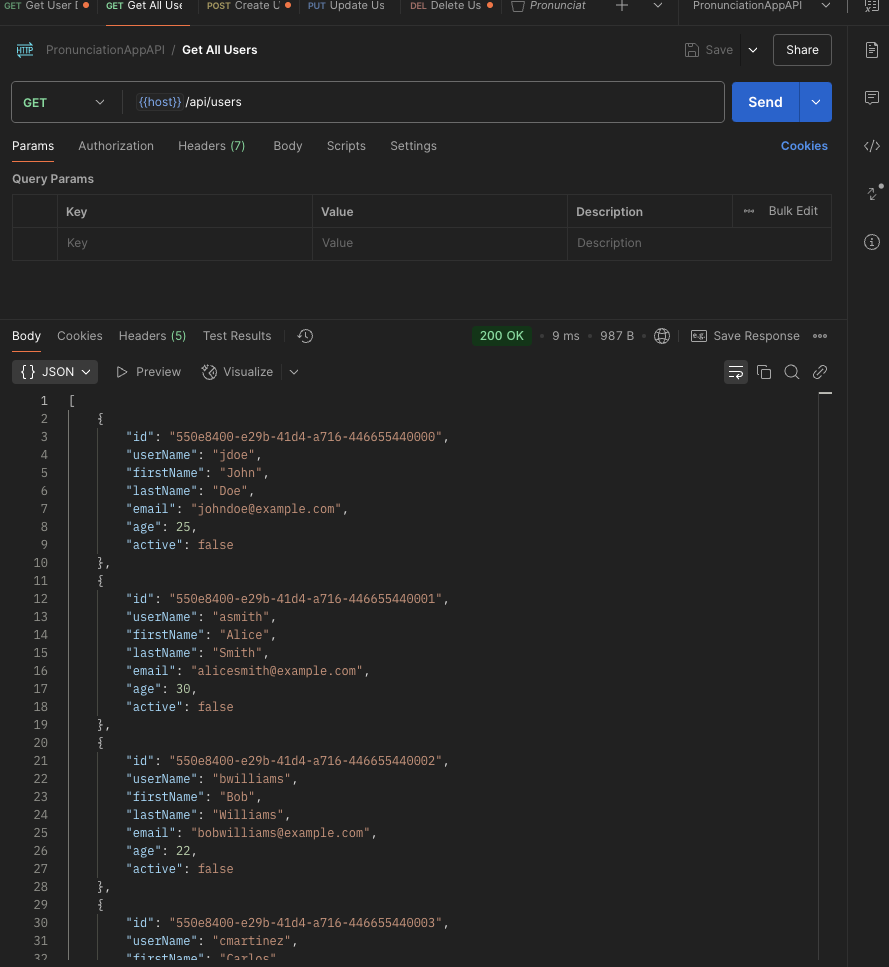
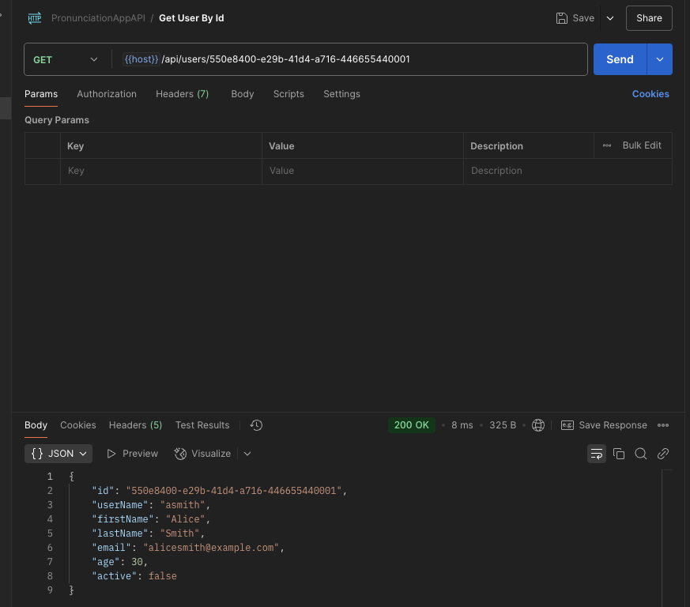
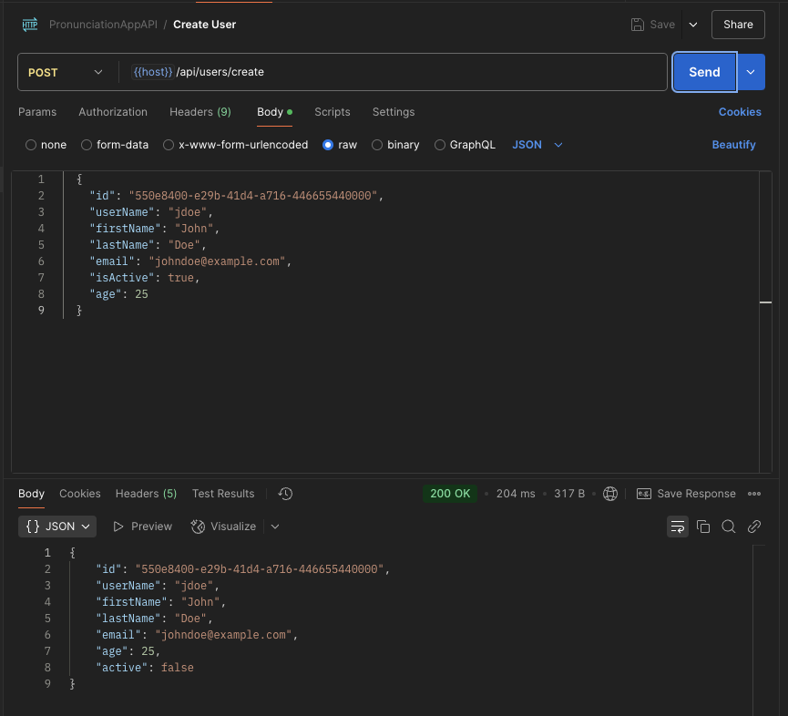
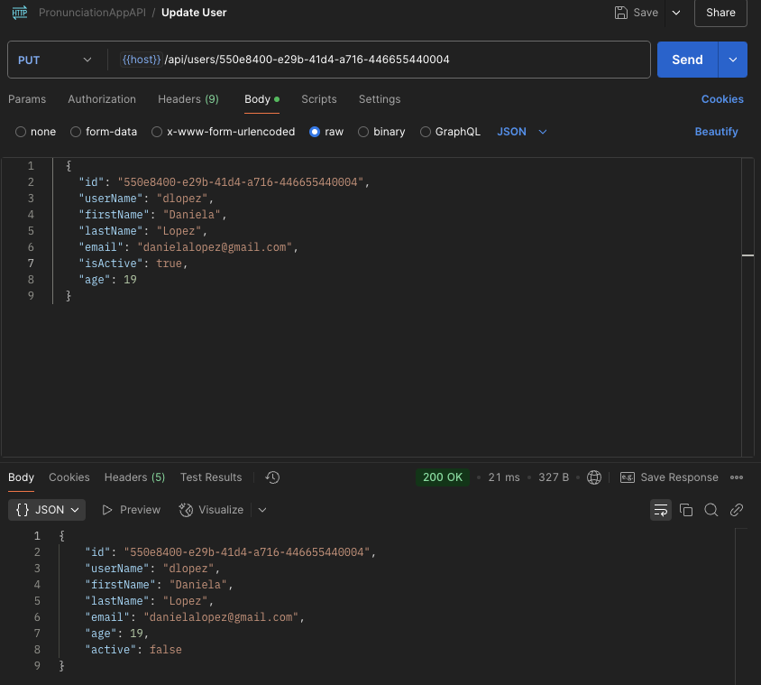
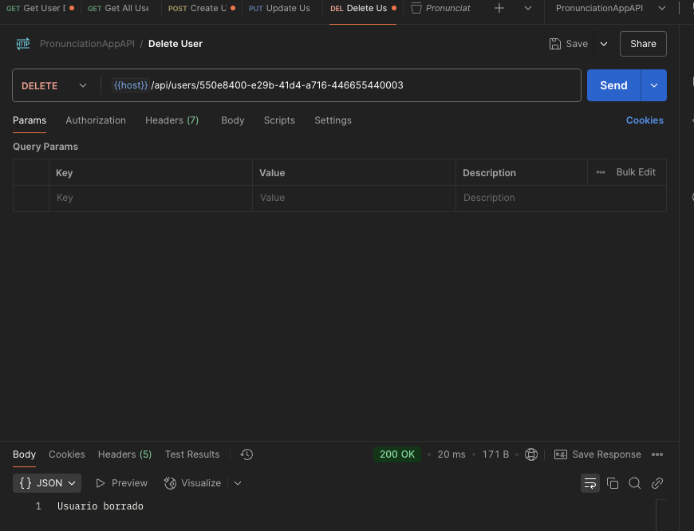
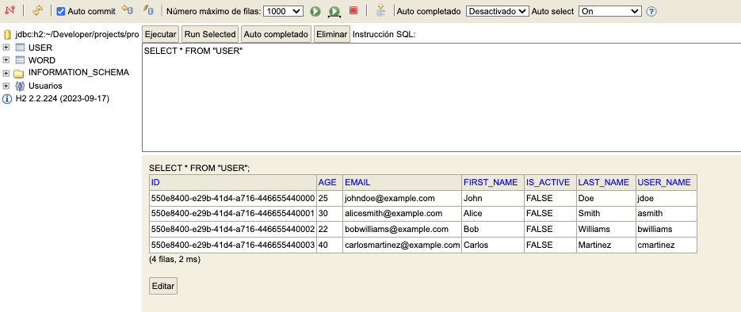

## Descripción
Este PR implementa la gestión de usuarios en una aplicación **Spring Boot**, cumpliendo con los siguientes requisitos:

1. **Crear la entidad User**
    - Se ha diseñado una entidad de usuario con los campos relevantes.
    - Se han añadido anotaciones de **JPA** para la persistencia.
    - Se han implementado **validaciones** con `@Id , @NotNull`, `@Email`, `@Min(18)`.

2. **Desarrollar UserController**
    - Se han creado **endpoints RESTful** para la gestión de usuarios.
    - Se ha añadido **manejo de errores** apropiado.
    - Se ha utilizado `ResponseEntity` para respuestas flexibles.

3. **Implementar UserRepository**
    - Se ha extendido `JpaRepository`.
    - Se ha asegurado una correcta interacción con la base de datos.

4. **Configurar la base de datos H2**
    - Se ha configurado **`application.properties`** para usar H2 en local.
    - Se han definido los parámetros de conexión.
    - Se ha habilitado la **consola H2** para desarrollo.

5. **Desarrollar UserService**
    - Se ha implementado la **lógica de negocio** para operaciones con usuarios.
    - Se ha agregado una capa de servicio entre el controlador y el repositorio.
    - Se ha incluido **validación y transformación de datos**.

6. **Pruebas con Postman**
    - Se ha creado una colección de pruebas para los **endpoints de usuario**.
    - Se han probado todas las operaciones **CRUD**.
    - Se ha verificado la **integridad de los datos y códigos de respuesta**.

---

## Capturas

### **Pruebas en Postman**
Se han ejecutado y validado las peticiones.
>️ **Obener los usuarios**

> **Obener usuario por id**

> **Crear usuario**

> **Actualizar usuario**

> **Eliminar usuario**

### 🛢️ **Base de Datos H2 en el Navegador**
Se ha verificado la persistencia de los datos en H2.

