## PRA#01-React: Components Frontend Development

In this documentation its exaplained the steps taken of the development.

---

### 1 - Create a Postman mock server

---

It was necessary to create a mock server in Postman. Inside the server, created both endpoints for users and words, like the image below:

 

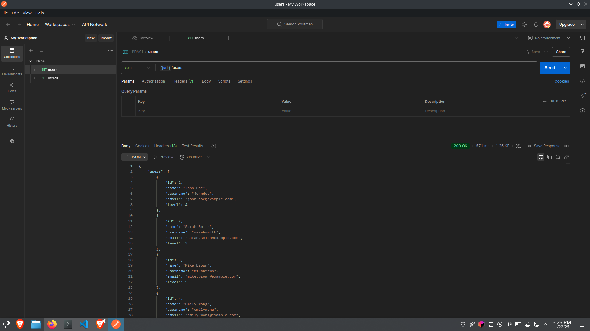
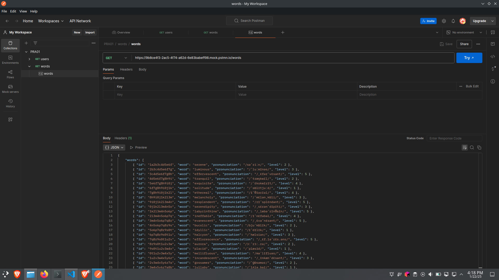

 

Used ChatGPT to create 30 objects in JSON for words and users.
This is an example of the few objects created:

 

"words": [
        {
            "id": "1a2b3c4d5e6f",
            "word": "serene",
            "pronunciation": "/səˈriːn/"
        }
]

 

"users": [
        {
            "id": 1,
            "name": "John Doe",
            "username": "johndoe",
            "email": "john.doe@example.com",
            "level": 4
        }
]

 

---

### 2 - Change the axios URL with the created Postman mock server

---

Changed the variable BASE_URL with the new link for the Postman mock server.
Created a new function called fetchUsers() that read the variable BASE_URL but withe users end point.
Heres the code implemented, and highlighted the changes:

 

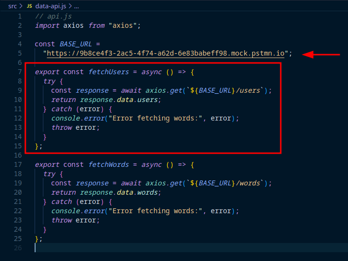

 

---

### 3 - Created the Users.jsx component

---

The use of the hooks: useState and useEffect are the same as the Cards component created by Professor Albert. The render is made using material UI components like: Box, Card, Avatar, Typography. The style of the component is inside the src/assets/styles/UserCard.css. Here is a picture of the project structure:

 

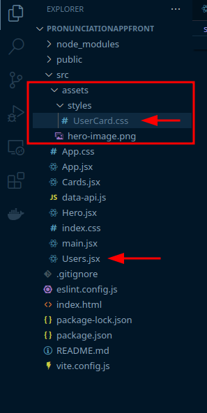

 

Inside the Users.jsx the render followed the idea of creating a Box to hold everything, then mapped the users data that the useEffect hook provided with from the axios. After mapping them, I created a Card with the user.id as key. Then follwed a hierarchy of creating Box components to hold the data inside, for example on the picture below we have Card -> Box -> Typography; CardContent -> Box -> Avatar && Typography;

 

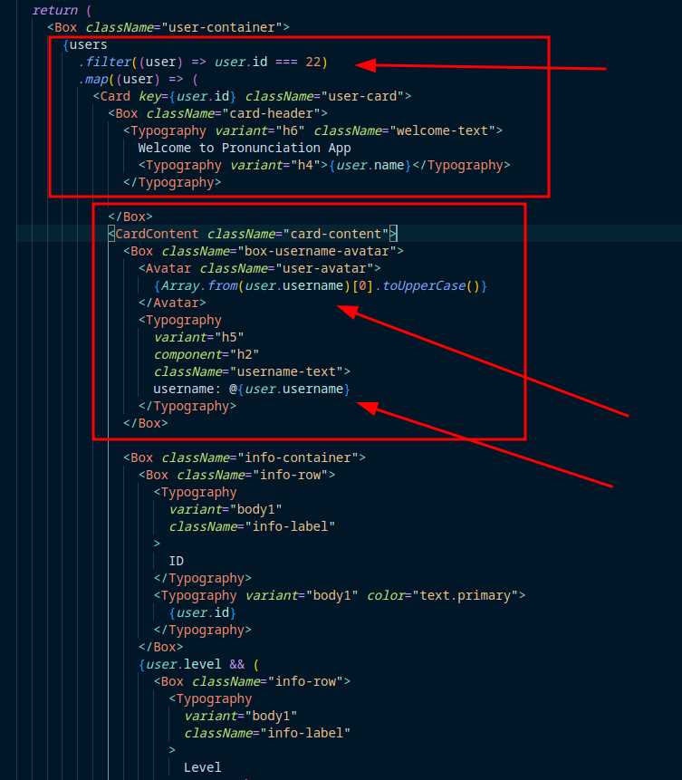

 

---

### 4 - Restructured the project for better undertanding and to follow a pattern

---

Created the folders: Components, Middleware.

Like the picture below, the project is better structured:

 

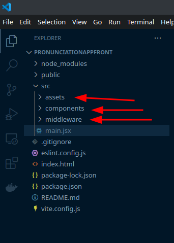

 

.png "new project structure(2)")

 

---

## Extra functionality:

### 5 - Added different background colors for words based on level of difficulty

---

I created a function to return a css color based on the level provided as parameter. Like the image below:

 

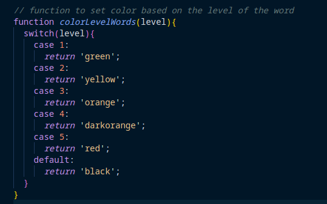

 

On the picture below we can see where the function is being used and the parameter being passed. Its being called inside the styling of the Card component of the word, and the parameter is the word.level.

 

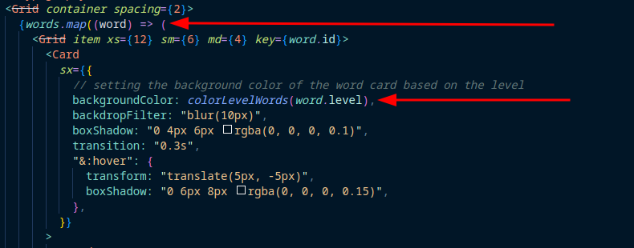

 

--- 

### 6 - Sorting the words based on their level when the user clicks on a button

---

To set the words, I created a sortByLevel() function to sort the words JSON based on their level on ascending order,also created another useState hook to manage the state of the button pressed. The sorting happends when the user presses a button, thats the trigger for the sortedWords happen. For example:

 

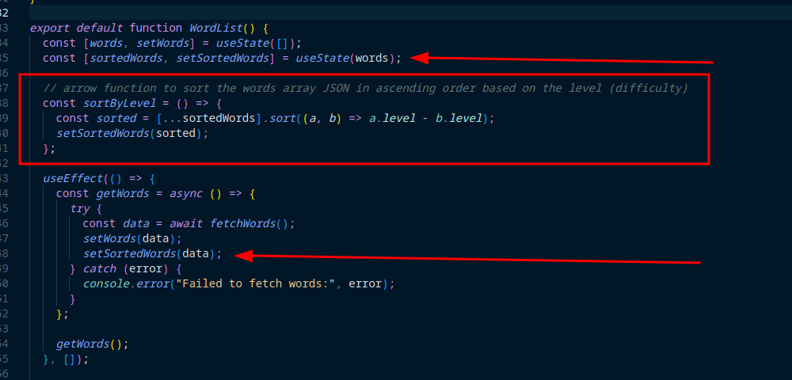

 

---

### Application working:

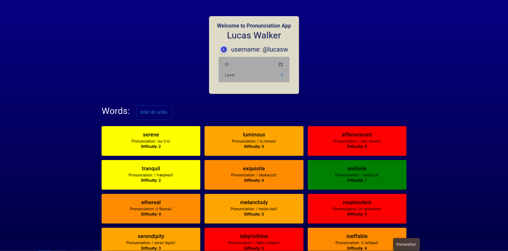

 

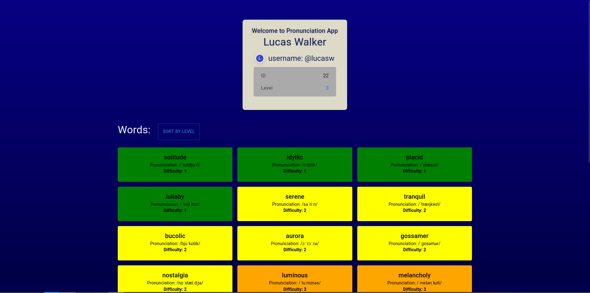
